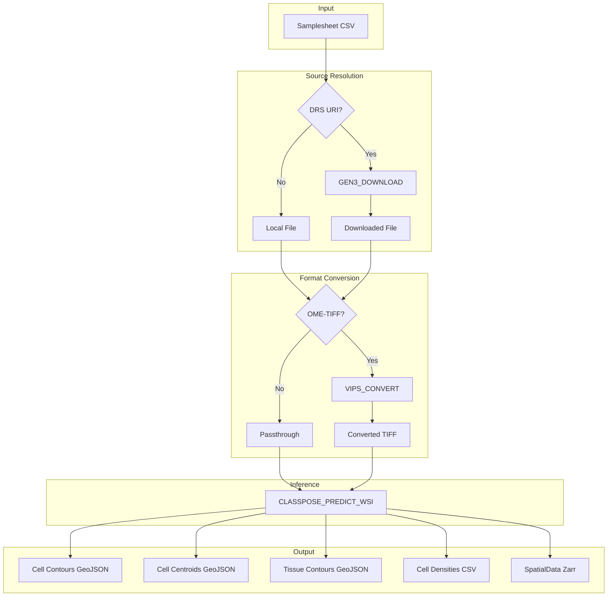

# nf-classpose

Nextflow pipeline wrapper for [Classpose](https://github.com/sohmandal/classpose) WSI cell classification.

## Features

- Simple CSV samplesheet input (just slide paths)
- Automatic OME-TIFF conversion to OpenSlide-compatible format
- Pre-built Docker container with conic model included
- Support for Docker, Singularity, and Apptainer
- GPU acceleration support
- Automatic OME-TIFF conversion to OpenSlide-compatible format
- DRS URI support for downloading files from Gen3/NCI CRDC

## Pipeline Overview



## Quick Start

```bash
# Run with Docker
nextflow run main.nf \
    --input samplesheet.csv \
    --outdir results \
    -profile docker

# Run with GPU support
nextflow run main.nf \
    --input samplesheet.csv \
    --outdir results \
    -profile docker,gpu
```

## Installation

### Requirements

- [Nextflow](https://www.nextflow.io/) (>=23.04.0)
- [Docker](https://www.docker.com/) or [Singularity](https://sylabs.io/singularity/) or [Apptainer](https://apptainer.org/)

### Containers

The pipeline uses multiple containers:

| Container | Description |
|-----------|-------------|
| `ghcr.io/adamjtaylor/nf-classpose:latest` | Main classpose inference container |
| `ghcr.io/adamjtaylor/nf-classpose-vips:main` | VIPS for OME-TIFF conversion |
| `ghcr.io/adamjtaylor/nf-classpose-gen3:latest` | Gen3 client for DRS downloads |

## Samplesheet Format

Create a CSV file with slide paths:

```csv
slide_path
/data/slide1.svs
/data/slide2.ome.tiff
/data/slide3.ndpi
```

| Column | Required | Description |
|--------|----------|-------------|
| `slide_path` | Yes | Path to WSI file (.svs, .tiff, .ndpi, etc.) or DRS URI |

Sample IDs are automatically derived from the slide filename (e.g., `slide1.svs` → `slide1`).

### DRS URI Support

The pipeline supports DRS (Data Repository Service) URIs for downloading files from Gen3-based repositories like NCI CRDC:

```csv
slide_path
drs://nci-crdc.datacommons.io/dg.4DFC/624693b0-7e68-11ee-a75b-033941d3e6da
/data/local_slide.svs
```

To use DRS URIs, you must provide Gen3 credentials:

```bash
nextflow run main.nf \
    --input samplesheet.csv \
    --gen3_credentials ~/.gen3/credentials.json \
    -profile docker
```

### OME-TIFF Support

OME-TIFF files (`.ome.tif`, `.ome.tiff`) are automatically detected and converted to OpenSlide-compatible pyramidal TIFFs using VIPS. The conversion preserves the physical pixel size (mpp) from the OME-XML metadata.

## Parameters

### Input/Output

| Parameter | Default | Description |
|-----------|---------|-------------|
| `--input` | required | Path to samplesheet CSV |
| `--outdir` | `results` | Output directory |

### Model Configuration

| Parameter | Default | Description |
|-----------|---------|-------------|
| `--model_config` | `conic` | Model: conic (only conic bundled in container) |

### ROI

| Parameter | Default | Description |
|-----------|---------|-------------|
| `--roi_geojson` | null | Path to ROI GeoJSON file (applied to all samples) |

### Tissue/Artefact Detection

GrandQC models are pre-bundled in the container.

| Parameter | Default | Description |
|-----------|---------|-------------|
| `--tissue_detection_model_path` | (bundled) | Path to GrandQC tissue model |
| `--artefact_detection_model_path` | (bundled) | Path to GrandQC artefact model |
| `--filter_artefacts` | false | Enable artefact detection and filter cells in artefact regions (memory-intensive on large slides) |

### Inference Settings

| Parameter | Default | Description |
|-----------|---------|-------------|
| `--batch_size` | 8 | Inference batch size |
| `--device` | null | Device (cuda:0, mps, cpu) |
| `--bf16` | false | Use bfloat16 inference |
| `--tta` | false | Enable test-time augmentation |

### Tiling Settings

| Parameter | Default | Description |
|-----------|---------|-------------|
| `--tile_size` | 1024 | Tile size in pixels |
| `--overlap` | 64 | Tile overlap in pixels |

### Output Options

| Parameter | Default | Description |
|-----------|---------|-------------|
| `--output_type` | `csv spatialdata` | Output formats: csv (density stats), spatialdata (Zarr) |

### VIPS Conversion Settings

| Parameter | Default | Description |
|-----------|---------|-------------|
| `--vips_compression` | `jpeg` | TIFF compression: jpeg, deflate, lzw, none |

### Gen3/DRS Settings

| Parameter | Default | Description |
|-----------|---------|-------------|
| `--gen3_credentials` | null | Path to Gen3 credentials JSON file |
| `--gen3_profile` | `htan` | Gen3 profile name |
| `--gen3_api_endpoint` | `https://nci-crdc.datacommons.io` | Gen3 API endpoint |

## Profiles

| Profile | Description |
|---------|-------------|
| `docker` | Run with Docker |
| `singularity` | Run with Singularity |
| `apptainer` | Run with Apptainer |
| `gpu` | Enable GPU support (combine with container profile) |
| `tower` | Resource settings for Seqera Platform (Tower) |
| `tower_gpu` | Tower with GPU acceleration |
| `tower_test` | Test profile for Tower using S3 samplesheet |
| `test` | Run with test configuration |

### Examples

```bash
# Basic run with Docker
nextflow run main.nf --input samples.csv -profile docker

# GPU-accelerated run
nextflow run main.nf --input samples.csv -profile docker,gpu

# Run with DRS URIs from NCI CRDC
nextflow run main.nf \
    --input drs_samples.csv \
    --gen3_credentials ~/.gen3/credentials.json \
    -profile docker,gpu

# Singularity with custom model
nextflow run main.nf \
    --input samples.csv \
    --model_config consep \
    -profile singularity,gpu

# Test profile
nextflow run main.nf -profile test,docker
```

## Outputs

The pipeline produces the following outputs for each sample:

| File | Description |
|------|-------------|
| `{sample_id}_cell_contours.geojson` | Cell contour polygons |
| `{sample_id}_cell_centroids.geojson` | Cell centroid points |
| `{sample_id}_tissue_contours.geojson` | Tissue contours (if tissue detection enabled) |
| `{sample_id}_artefact_contours.geojson` | Artefact contours (if artefact detection enabled) |
| `{sample_id}_cell_densities.csv` | Cell density statistics (if --output_type csv) |
| `{sample_id}_spatialdata.zarr` | SpatialData object (if --output_type spatialdata) |

## Building the Containers Locally

```bash
# Build main classpose container
docker build -t ghcr.io/adamjtaylor/nf-classpose:latest docker/

# Build VIPS conversion container
docker build -t ghcr.io/adamjtaylor/nf-classpose-vips:main -f docker/Dockerfile.vips docker/

# Build Gen3 client container (requires amd64 for gen3-client binary)
docker build --platform linux/amd64 -t ghcr.io/adamjtaylor/nf-classpose-gen3:latest -f docker/Dockerfile.gen3 docker/
```

## License

MIT
